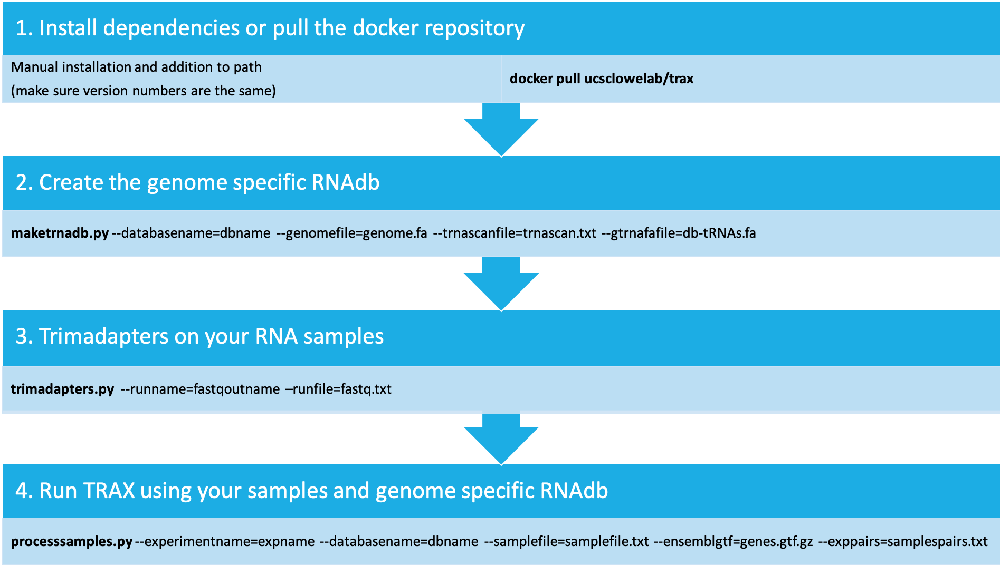

# TRAX

# Dependencies

* Python 2.7 or higher
* pysam Python library (Older versions have a memory leak, make sure you have an updated version)
* bowtie2
* samtools
* R
* Deseq2 R library
* getopt R library
* ggplot2 R library
* Infernal 1.1 or higher
* The TestRun.bash script requires the SRA toolkit(fastq-dump) and cutadapt to function

# Quickstart

* Skip to the ["Required input files"](#required-input-files) part to jump right to how to use it
* There is also the "TestRun.bash" file, which is an example of a full analysis

# About

* This is a set of programs that are designed to analyze tRNAs in small RNA sequencing data.
* There are a number of issues with just mapping to the genome.  Since tRNAs are spliced and modified, tRNA reads may not map, or may mis-map.
  * The most common error is that when a tRNA that exists in many copies is only mapped to one, due to partial mapping of the CCA end onto genomic sequence
* This solves this issue by mapping to both the set of mature tRNAs, and the genome

# Concepts

* This program creates a set of unique "transcript" sequences from the tRNAscan, as well as the loci
  * "Transcripts" are created by taking the locus sequence, removing the intron, and adding CCA and the 5-prime G base to histidine tRNAs
    * As stored, these are padded with N-bases to prevent mapping failure when reads extend off the end of the transcript, IE tRNAs marked for degradation with CCACCA
  * Transcript names are created by the program for tRNAscan input, and are similar to "tRNA-MetAUG1"
    * These are unique, and many tRNA loci can correspond to a single transcript
  * Locus names are the names created by tRNAscan, IE "chr16.trna7-AlaAGC"


* This program uses an all-best mapping strategy, where all reads that map as well as the best to the genome are returned
  * There is an exception to this rule as described below, where for reads that have best mappings to both genome and tRNA transcript, the mappings to the genome are discarded


* This program maps to both the genome and the set of unique mature tRNA sequences
  * Reads that map to the mature transcript better or equally to the genomic tRNA locus are called as "transcript" reads and are counted as part of the transcript
  * Reads that map to the genomic locus better than the transcripts are "pre-tRNA" reads
    * This happens when a tRNA contains bits of leader, trailer, or intron
    * The "pre-tRNA" reads may not contain the whole pre-tRNA, and may just be a fragment.
    * "pre-tRNA" reads may in some cases be in middle stages of processing, IE contain both intron and CCA tail.
  * transcript reads are identified by a transcript name, and pre-tRNA reads by the name of the locus
  * Transcript reads are separated into fragments


* This program separates tRNA transcript reads into multiple fragment types.  Currently, these are:
  * "Whole" tRNAs are those that are within 10 bases of the start and end of the full tRNA sequence
  * "5 prime" reads are within 10 bases of the start, but do not reach the end
  * "3 prime" reads are within 10 bases of the end, but do not reach the start
  * "Other" fragments are those that do not fit any of those categories
* pre-tRNA reads are separated as well
  * "Trailer" fragments are those that start right after the tRNA transcript ends.
  * All other fragments are just counted as part of the pre-tRNA


* Statistical analysis is done using DESeq2, and outputted as tables
  * Both counts for different tRNA fragment types and non-tRNA are used as input to DESeq2
  * Default parameters are used, and output is an all-vs-all comparison of samples
  * The Size Factors are how DESeq2 normalizes samples
  * normalized table is the raw counts divided by the size factors for the sample
  * logvals are the log-fold changes between sample types created by DESeq2
  * padj are the adjusted p-values created by DESeq2
* typecounts are a way to measure the share of the reads taken up by various feature types
  * Only counts primary reads, as defined by the flag in bam files
    * These flags are reset from the raw bowtie2 output when the mapping selection is done, there is guaranteed to be only one primary mapping per read
    * When a read maps to multiple feature types, this is effectively selecting one at random
  * Counts are done for transcript fragment types, pre-tRNAs, non-tRNAs as supplied to the program and "other" reads that do not map to any known feature
    * If the number of reads in the "other category is high, then you may want to find another set of features that more closely matches the sequencing data
  * Both a table and a barchart of typecounts are created
* Coverage is measuring read coverage across aligned tRNAs.
  * tRNAs are aligned by using the same models used for tRNAscan-SE, slightly modified to account for post-transcriptional changes
    * Introns are removed, CCA added, and 5-prime G base added to Histidine tRNAs
  * Base coverage is counted for every base in the tRNA for every transcript and sample
  * Alignment columns are annotated with the Sprinzel tRNA numbers, with a few complications
    * Columns not in sprinzel positions are given arbitrary names like "gap1", "gap2" etc
    * Columns before and after the tRNA are given names "head1" ... , "tail1" ... resplectively
  * These are visualed in the "coverage" and "allcoverage" table
    * "coverage" shows  grid for each tRNA transcript and sample
    * "allcoverage shows for each sample, the total tRNA coverage and is colored by amino acid.
    * There are also the "uniq" files, these coverage colored by specificity of the mapping
      * Coverage is separated into reads that uniquely map to transcript, unique to a single anticodon, unique to a single amino acid, or nonunique

# Required input files

* Genome sequence FASTA file
* tRNAscan-SE output file
  * You can create this by running tRNAscan-SE on the Genome sequence FASTA file
* Fastq file from short RNA sequencing
  * Only accepts single-end reads
    * The best input is actually paired-end reads can merged to unpaired reads with a program like seqprep.
* GTF file of non-tRNA features
  * This file needs to contain enough of the non-tRNA features to be used for normalization
  * The ensembl gene set is generally a good starting point
* Sample file containing information on fastq files
  * Described below
  * If no replicates are present, experiment will be harder to analyze
* Sample file containing information on fastq files
  * Described below
  * If no replicates are present, experiment will be harder to analyze
* Pair file containing pairs of samples
  * Described below
  * optional, without it no scatter plots will be created and Deseq results will be all vs. all

# Docker

* You can download the docker image from dockerhub using the command `docker pull ucsclowelab/trax`
* We have also included a `Makefile` for quickly building packages for popular genomes (Hg19, Hg38, etc)
  * These can be created with the command `make build-hg19` for example
* **Warning:** Docker can fail to run on non-linux server environments if not given adequate RAM

# Special file formats

* Sample file consists of information needed to determine replicate and sample information
  * 3-column tab separated format.   First column is a unique replicate name, second column is a sample name that is identical between replicates, third column is fastq file
* Pair file consists of samples to be compared to each other
  * 2-column tab separated format.   First column is a sample name, second column is a another sample name to compare it to

# How to run



## maketrnadb.py

* Create tRNA database
* **Usage**: `maketrnadb.py --databasename=dbname --genomefile=genome.fa --trnascanfile=trnascan.txt --gtrnafafile=db-tRNAs.fa`
  * dbname is the name that will be used for that database
  * trnascan.txt is the output of a tRNAscan-SE run on the genome
  * genome.fa contains a fasta file of the genome
  * db-tRNAs.fa.fa is the tRNA fasta file from gtRNAdb(Used for getting the tRNA names)
* Need to do this once for each organism

## trimadapters.py

* Trim fastq adapters from paired reads
* **Usage**: `trimadapters.py --runname=expname --runfile=fastq.txt`
  * runname is the name that will be used for trimmed and merged fastq output
  * runfile is a file that has the desired output name and the two fastq input files per line

## processsamples.py

* Map reads and analyze
* **Usage**: `processsamples.py --experimentname=expname --databasename=dbname --samplefile=samplefile.txt --ensemblgtf=genes.gtf.gz --exppairs=samplespairs.txt`
* expname is a name that will be used for results
* dbname is the directory and name of a database from a previous run of `maketrnadb.bash`
* samplefile.txt is a sample file in the format described above
* genes.gtf.gz is the ensembl GTF for that species (Often, you need to rename chromosomes)
 * A command I've use to get the ensembl transcript is
 ```
 "wget -q -O * ftp://ftp.ensembl.org/pub/release-75/gtf/homo_sapiens/Homo_sapiens.GRCh37.75.gtf.gz | gzip -cd | grep -v '^#' | awk '{print "chr" $0;}' | grep -e Mt_rRNA -e miRNA -e misc_RNA -e rRNA -e snRNA -e snoRNA -e ribozyme -e sRNA -e scaRNA  >hg19-genes.gtf"
 ```
* samplespairs.txt is an optional argument that contains sample pairs to compare
* by default, will not remap reads if mapping files exist.  `--force` argument will force remapping

## Output files

* All output files aside from mappings are outputted to expname directory
* expname-mapstats.txt
  * Bowtie2 mapping statistics for each sample
* expname-counts.txt
  * Raw counts for each tRNA fragment type and all included non-trna features
* expname-normalized.txt
  * counts as above, normalized using Deseq2 size factors
* expname-SizeFactors.txt
  * Deseq2 size factors for each sample
* expname-logvals.txt
  * Deseq2 log-fold changes of all pairs of samples in experiment
* expname-padjs.txt
  * Deseq2 adjusted p-values of all pairs of samples in experiment


* expname-typecounts.txt
  * Read distribution of primary read mappings amongst tRNA fragment types, non-trnas, pre-trnas, and unannotated features
* expname-typecounts.pdf
  * Visualization of above read distribution
* expname-coverage.txt
  * Aligned Base-wise normalized coverage of reads for all tRNAs and samples, using Sprinzel tRNA numbering
* expname-coverage.pdf
  * Visualization of above
* expname-combinedcoverage.pdf
  * Summary chart showing read distribution for entire samples, separated by acceptor type
* expname-uniquecoverages.pdf
  * Visualization of coverage colored by degree of uniqueness in mapping


* sample1_sample2-typescatter.txt
  * Log of normalized read counts for each fragment type, colored by gene type
* sample1_sample2-aminoscatter.txt
  * Log of normalized read counts for tRNA fragment types.  non-tRNAs are the small black dots, tRNA fragment types are separated
